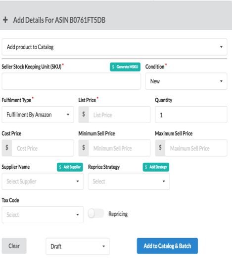
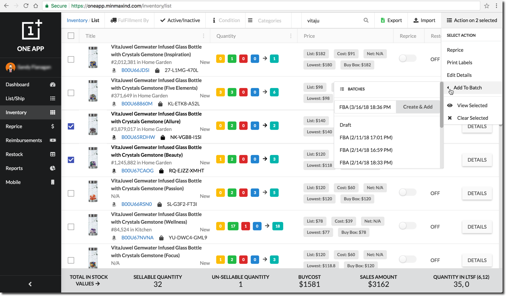
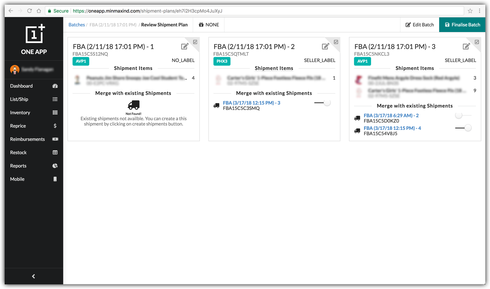

# LIST/SHIP

## ADD TO SHIPMENT {#step1}

### Products not in Seller’s Catalog:

1. Search a product using Title, ASIN, UPC, EAN or ISBN on List/Ship → List Products [page](https://oneapp.minmaxind.com/list/product-search).
2. Click on `Add to Shipment` button to add a product to a shipment. 
3. Seller can manually add a SKU or generate a new SKU using the button Generate MSKU.
4. Similarly you can add in your Product Cost Price/List Price and required Quantity to ship.
5. After adding all the details to product. Click on `Add to Shipment` button to add a product to a shipment. It will take you to the Add To Shipment → Review Items page.
6. Review items page shows you the amazon recommended distribution of product across multiple warehouses.
7. To increase/decrease the quantity of product, enter the new quantity and click on`Save` button.
8. Click on the edit icon to edit product details.
9. Hover on the shipment ID to change the selected shipment. You can create a new WORKING Shipment or choose from existing WORKING shipments if any.
10. Initially default name is provided for new shipments, However you can edit the shipment name.
11. You can view the existing items inside shipment by clicking on info icon in front of the shipment ID.
12. If you don't want to send the items to particular warehouse. You can remove that quantity by clicking on remove icon in front of the particular shipment ID.
13. Once you finished reviewing the items. Now you can click on`Create Shipments` button to add the items to shipments on amazon.

## ADD TO BATCH {#step1}

### Products not in Seller’s Catalog:

1. Search a product using Title, ASIN, UPC, EAN or ISBN on List/Ship → Search Product [page](https://oneapp.minmaxind.com/list/product-search).
2. Click on `Add to Batch` button to add a product in a batch.
3. Seller can manually add a SKU or generate a new SKU using the button Generate MSKU.
4. Similarly you can add in your Product Cost Price/List Price and required Quantity to ship.
5. Seller can add in Minimum/Maximum Sell Price for a repricer at the time of adding a product, similarly he can choose the reprice strategy to be applied to this product, reprice can be enabled for this product right away using the Reprice toggle button on this form, which would only be enabled if min, max price and strategy is selected.
6. Seller can choose from the dropdown if he wants to add a product to a `DRAFT`_**\(default\)/**_`OPEN` /`NEW` ****batch

> ```text
> Before shipping a product to Amazon, it is must to list product in seller’s catalog.
> If seller wants to list a product using a different SKU he also has to choose this process.
> ```

### Products Exist in Seller’s Catalog:

#### Add Single Product to Batch:

1. Search a product using Title, ASIN, UPC, EAN or ISBN on List/Ship → Search Product page.
2. Click on Add to Batch button to add a product in an DRAFT or OPEN batch.
3. By default first Amazon fulfilled product exists in a catalog would be selected with a condition and SKU, seller can choose from a list if it has multiple products with that ASIN, Form would be auto filled with last used values for this product.
4. Similarly you can add in your Product Cost Price/List Price and required Quantity to ship.
5. Seller can add in Minimum/Maximum Sell Price for a repricer at the time of adding a product, similarly he can choose the reprice strategy to be applied to this product, reprice can be enabled for this product right away using the Reprice toggle button on this form, which would only be enabled if min, max price and strategy is selected.
6. Seller can choose from the dropdown if he wants to add a product to a DRAFT or OPEN batch.

#### Add Multiple Products to Batch:

1. Go to Inventory → List Page, find products using custom filters, Seller can select multiple products using checkbox, selected products would be preserved while you can change filters and select other products for the batch. You can view selected products anytime using the View Selected option, and clear selection using Clear Selection option.
2. Seller can choose from the Add To Batch dropdown if he wants to add a product to a `DRAFT` or `OPEN` batch.

## STEP 2: WORK ON BATCH {#step2}

Here's a line for us to start with  
1. Go to List/Ship → Batches page to finalize your OPEN/DRAFT batch.  
2. To finalize click on `WORK` button to continue to Create Shipment Plan page.

> ```text
> By default batch privacy would be OPEN to every user, which means any user can add items to this batch,
> if it is LOCKED only a user who has created can add items
> ```

1. User can edit the batch name, select the batch privacy, ship from warehouse, package and label types for a particular batch.
2. Seller can manually enter/update any field directly or use the Add Details to Selected button to bulk edit the Cost Price, Minimum price, Maximum price or Quantity.


> ```text
> Product Catalog Status (hover on status for details)
> EXIST: Product Already exist in seller’s catalog
> **PENDING**: Adding a new product to catalog is in progress
> ERROR: A Product cannot be added to seller’s catalog because of any error, you cannot go to next step without removing this product from the batch.
> ```

1. You can press Create Shipment Plan button to proceed, in case of errors you can see the errors on screen and you need to fix

   any errors mentioned.

## STEP 3: FINALISE BATCH {#step3}

1. A shipment plan would suggest to create multiple shipments recommended by Amazon based on Fulfilment center and Label Type. App would show any existing shipments for the same Fulfillment Center and Label type next to a shipment recommended by amazon so that can be merged. If you want to merge with an existing shipment you can mark the checkbox otherwise a new shipment would be created. A recommended shipment can be removed using a \(x\) button at the end of row.
2. You can also select the Box Content Source for the newly created shipments from the top menu, you can choose between ****`NONE`_**\(default\)**_, `2D Barcode` and `FEED`
3. You can press Create Shipments to proceed, you would be taken to shipments page where you can view the shipments created by this particular  batch.

## STEP 4: PACK BATCH {#step4}

1. You would be redirected to **List/Ship → Shipments** [page](https://oneapp.minmaxind.com/list/shipments) to finalise a shipment.
2. You can `Edit`**/**`Update`**/**`Remove` ****and Print Shipping Labels for any shipment.
3. Click on `ITEMS` button to View/Pack shipment items into boxes.
4. Select the items using the checkbox, you can add a custom quantity to a box by editing the Qty to Box field, click on the Add to Box button to add items into an existing box or create a new box.
5. Item quantity in a box can be edited in the box and you are also able to add a custom expiry date to a product.
6. A product can be removed from a box using delete button, Item label can be printed using the print button.
7. Shipment Item List shows the number of products in a particular box and the remaining quantity to be packed.
8. When All items are successfully packed to boxed you can submit a feed using a Submit Feed button on the top.

