# LIST/SHIP

## STEP 1: ADD TO CATALOG

Seller can add a product to catalog by any of following Methods.

* [ADD TO BATCH](./#step1).
* [ADD TO SHIPMENT](./#step1-1).

## ADD TO BATCH {#step1}

### PRODUCT NOT IN SELLER'S CATALOG

1\) Search a product using Title, ASIN, UPC, EAN or ISBN on List/Ship → List Products page.

2\) Click on `Add to Batch` button to add a product in a batch.

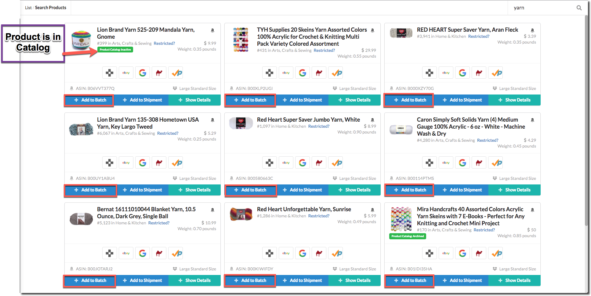


**Product Catalog: Archived** Tag means Product removed from Seller's Catalog


3\) If Product is previously Added To Catalogue Seller Sku is selected in MSKU Dropdown else Seller can use ADD NEW option of MSKU Dropdown to **Generate** a new SKU.


Product is Added To Catalog if you use ADD NEW option of MSKU Dropdown else Product Quantity is Increased.


4\) Enter **Ship From Warehouse**, **Packing Type,** **Labelling Preference, Batch Privacy, Batch Name & Select Batch** to add product to batch.


Seller can choose from the dropdown \(Select Batch\) if he wants to add a product to a Draft/Open/New.


5\) Add Quantity to ship and you can Edit any Information\(In Information, Repricer & Restock Tabs\) you want.

6\) After adding all the details to product. Click on `Add to Batch` button to add product to a batch.

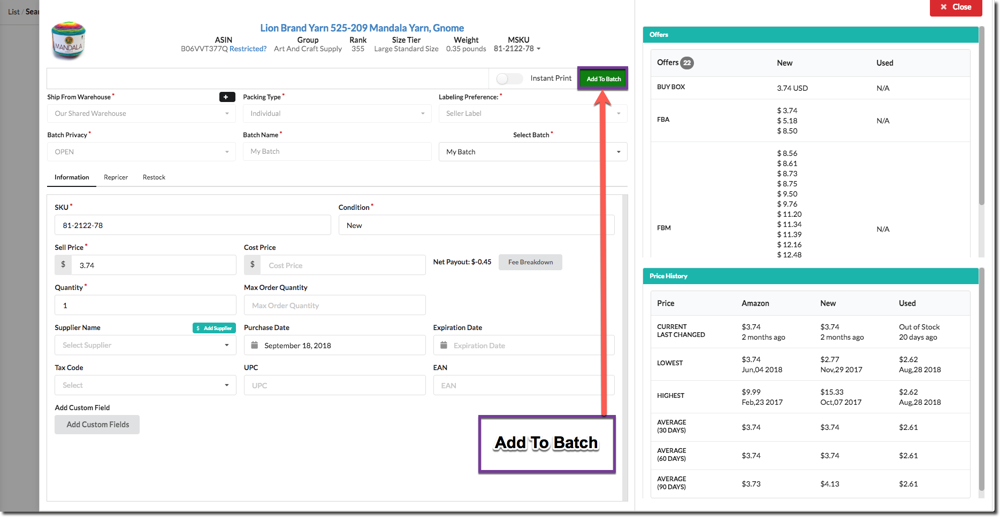

### PRODUCT EXIST IN SELLER'S CATALOG

#### ADD SINGLE PRODUCT TO BATCH

Same as Product is [Not in Seller's Catalog](./#product-not-in-sellers-catalog).

#### ADD MULTIPLE PRODUCTS TO BATCH

1\) Select items you want to add to batch.

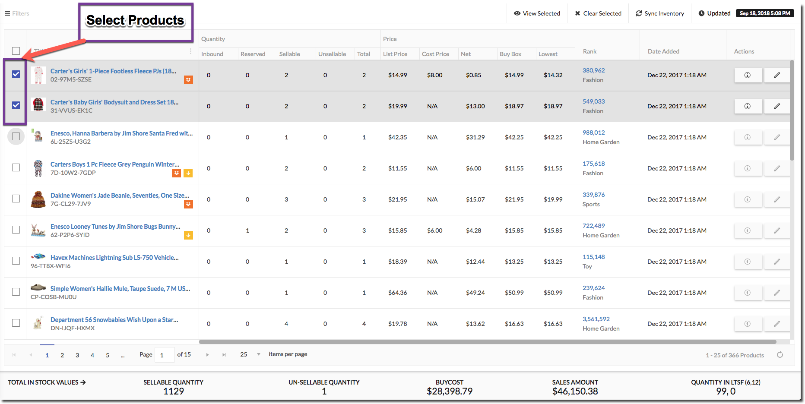

2\) Click on `Add to Batch` option to add products to a batch.

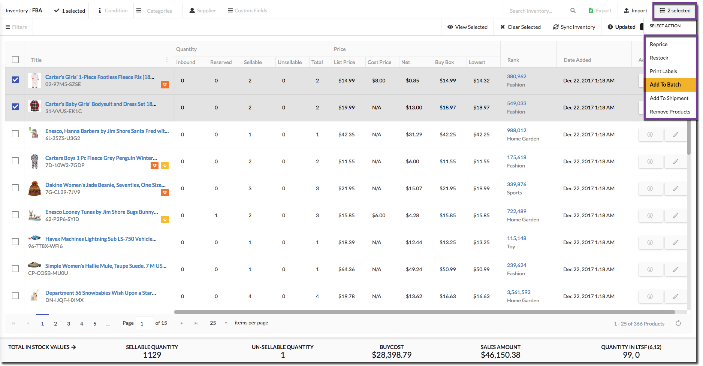

3\) Enter  **Ship From Warehouse**, **Packing Type,** **Labelling Preference, Batch Privacy, Batch Name & Select Batch** to add product to batch.

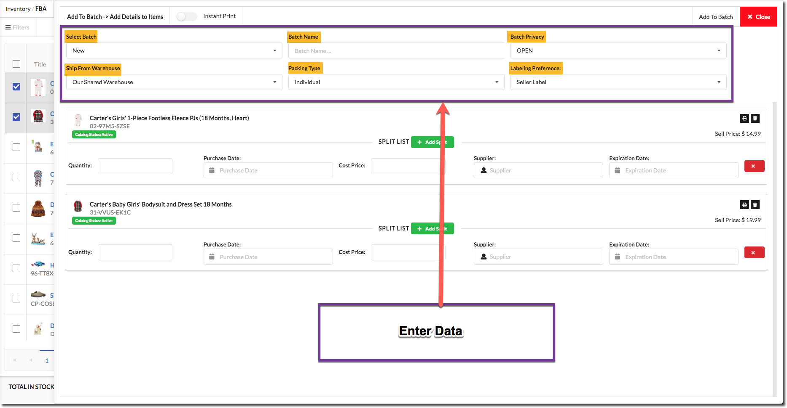

4\) Add Quantity of Product\(s\) you want to add to batch.

5\) You can also enter\(if any\) Purchase Data, Cost Price, Supplier and Expiration Date for each product.

6\) Use Add Split on Product Quantity to Ship Product if there is difference of Data\(Purchase Data, Cost Price, Supplier or Expiration Date\) between them.

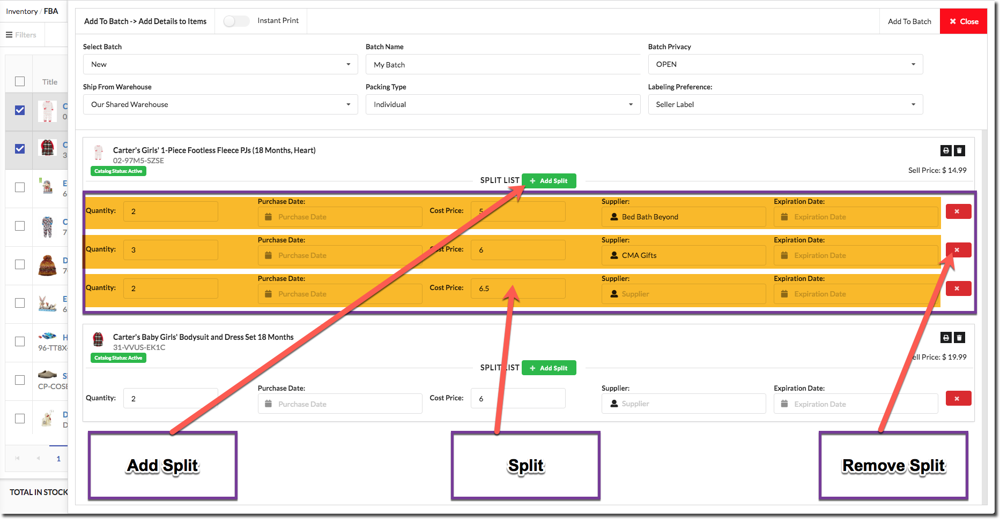

7\) After adding all the details to product. Click on `Add to Batch` button to add products to selected batch.

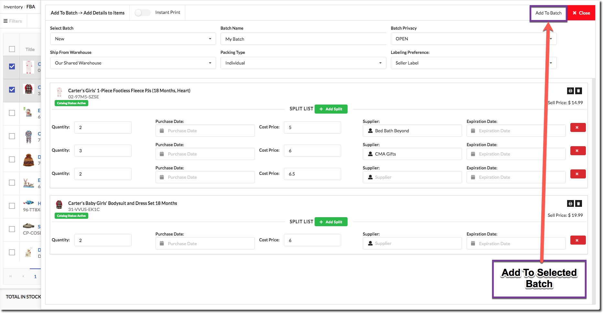

## ADD TO SHIPMENT {#step1}

### FROM LIST PRODUCTS PAGE

1\) Search a product using Title, ASIN, UPC, EAN or ISBN on List/Ship → List Products page.

2\) Click on `Add to Shipment` button to add a product to a shipment.


**Product Catalog: Archived** Tag means Product removed from Seller's Catalog


3\) If Product is previously Added To Catalogue Seller Sku is selected in MSKU Dropdown else Seller can use ADD NEW option of MSKU Dropdown to **Generate** a new SKU.


Product is Added To Catalog if you use ADD NEW option of MSKU Dropdown else Product Quantity is Increased.


4\) Enter **Ship From Warehouse**, **Packing Type** and **Labelling Preference** to add product to shipment.

5\) Add Quantity to ship and you can Edit any Information\(In Information, Repricer & Restock Tabs\) you want.

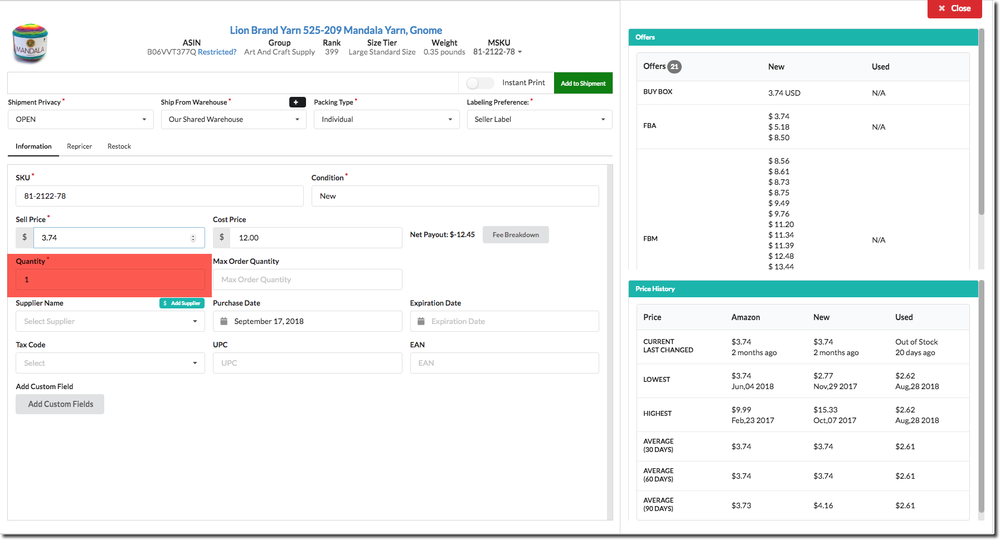

6\) After adding all the details to product. Click on `Add to Shipment` button to add a product to a shipment. It will take you to the Shipment → Review page.

7\) After verifying your related information on [**Review Page**](./#review-items-page) click on `Create Shipments` button to Ship Product according to Quantity.

### FROM INVENTORY/LIST PAGE

1\) Select items you want to add to shipment.

2\) Click on `Add to Shipment` option to add products to a shipment.

3\) Enter **Ship From Warehouse**, **Package Type** and **Labelling Preference** to add product to shipment.

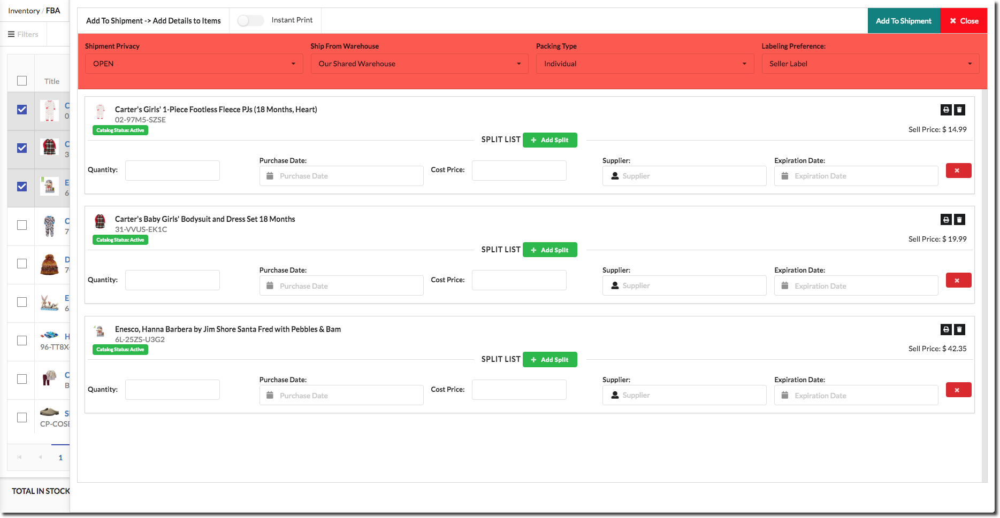

4\) Add Quantity of Product\(s\) you want.

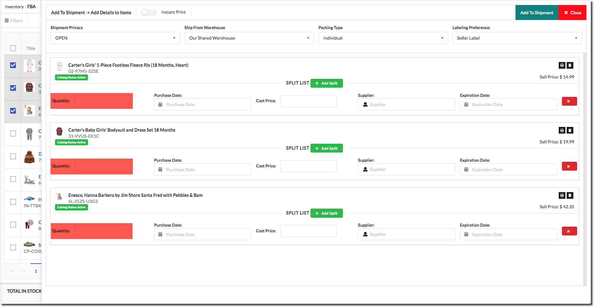

5\) You can also enter\(if any\) Purchase Data, Cost Price, Supplier and Expiration Date for each product.

6\) Use Add Split on Product Quantity to Ship Product if there is difference of Data\(Purchase Data, Cost Price, Supplier or Expiration Date\) between them.

7\) After adding all the details to product. Click on `Add to Shipment` button to add products to a shipment. It will take you to the Add To Shipment → Review Items page.

8\) After verifying your related information on [**Review Page**](./#review-items-page) ****click on `Create Shipments` button to Ship Product according to Quantity.

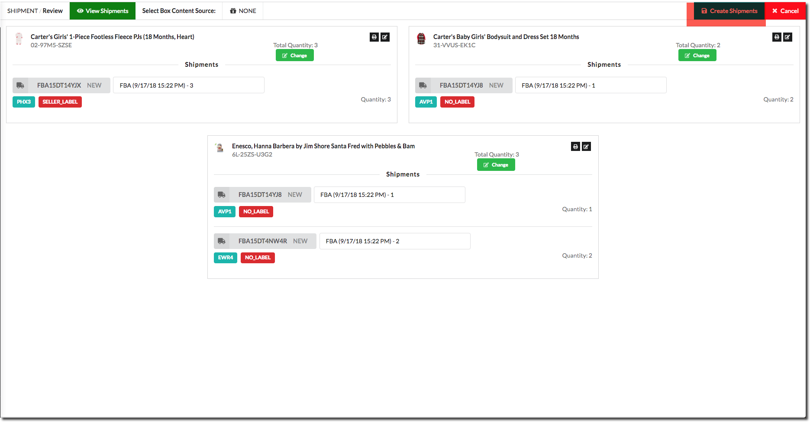

### REVIEW ITEMS PAGE

1\) By Default Review page shows you Product Wise Data.

2\) Click on`View Shipments`Button to view Review page in Shipment View.

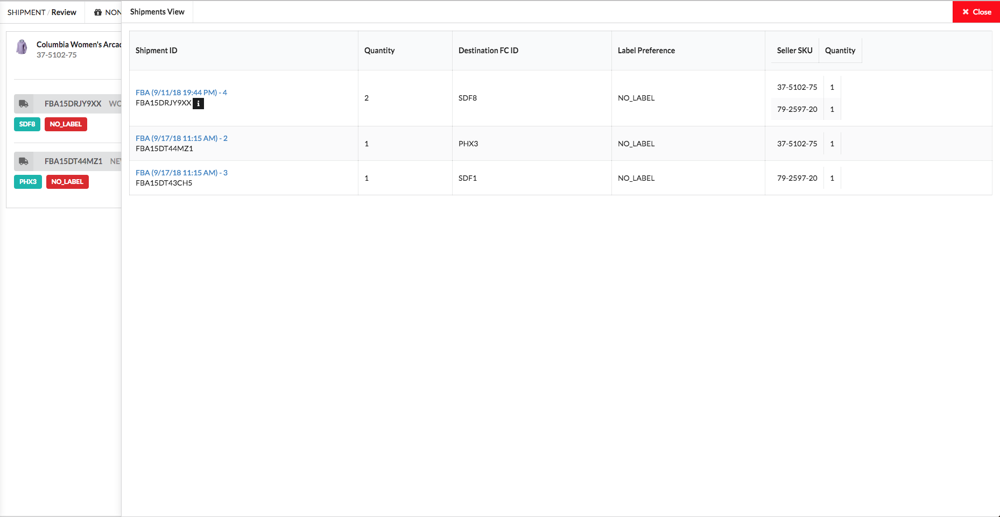

3\) Use following Dropdown to change Box Content Source.

4\) Hover on the printer icon to edit quantity of labels to be printed and click printer icon button.

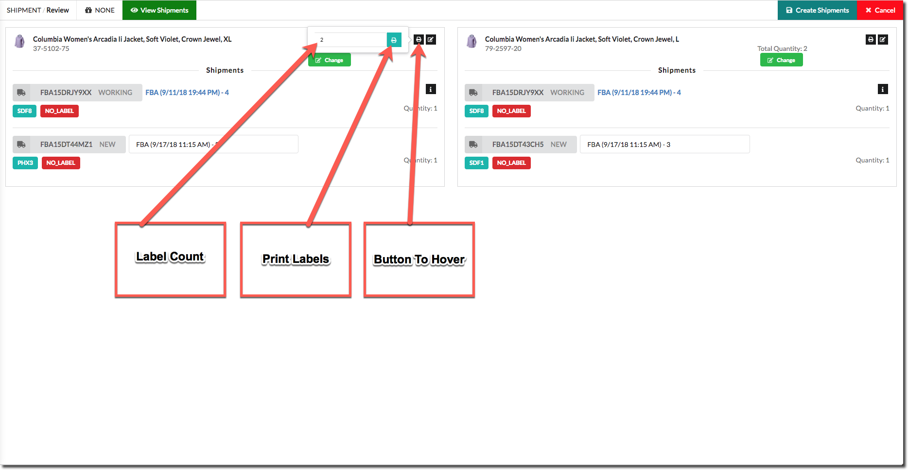

5\) Click on the edit icon to edit product details.

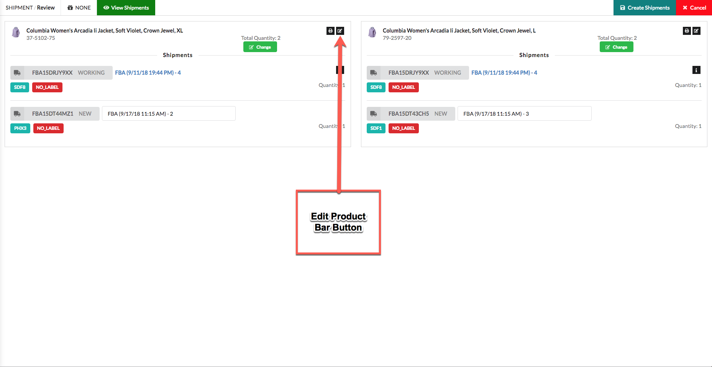

6\)To increase/decrease the quantity of product perform following tasks.

     1\) Click `Change`Button.

     2\) Click on `+`Button to Add a Split.  
     3\) Enter Data.  
     4\) Click on `Save Changes`Button to Save.  
     5\) Click on`x`Button to Remove a Split.

7\) By default existing WORKING shipment has been selected. You can hover on the shipment ID to choose from existing WORKING shipments or new shipment \(If you don't want to merge with any existing shipment\).

8\) Initially default name is provided for new shipments, However you can edit the shipment name.

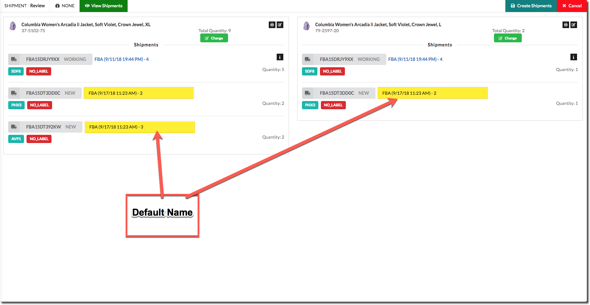

9\) You can view the existing items inside shipment by clicking on info icon in front of the shipment ID.

10\) Once you finished reviewing the items. Now you can click on`Create Shipments` button to add the items to shipments on amazon.

## STEP 2: WORK ON BATCH {#step2}

1\) Following is The Layout of page.

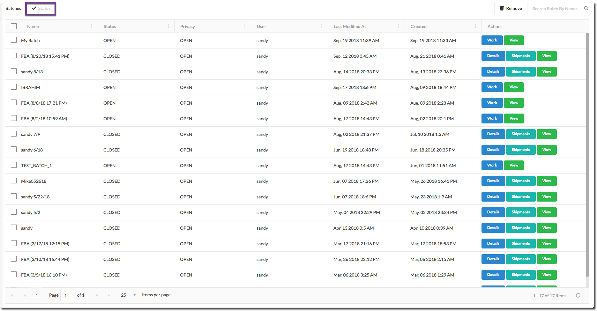

2\) Status Dropdown.

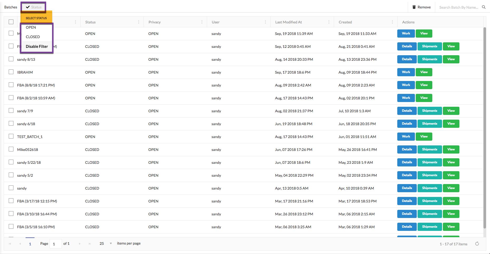

3\) Click on`Work`button To start Working on Batch. You are on [Review Page](./#review-items-page) now.


By Default Batch Privacy is OPEN. User\(s\) can Add Items to Open Privacy Batch.  
LOCKED Batch Privacy can only be Edited by its Creator.


4\) Closed Batch is closed for Everyone.

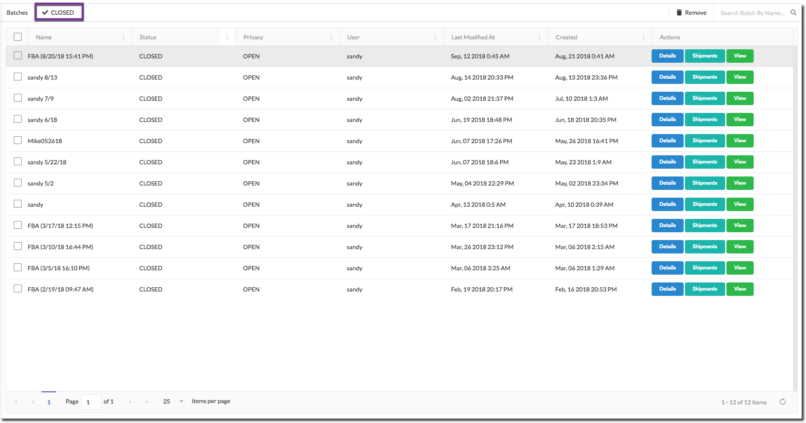


OPEN is Open for Editing.  
CLOSED is Closed for Editing.


## STEP 3: PACK BATCH {#step4}

1\) Go to **List/Ship → Shipments** to finalise a shipment. You can `Edit`**/**`Update`**/**`Remove` ****and `Print Shipping Labels`for any shipment. Clicking `Work`button redirects to **Shipments →Items** page to View/Pack Shipment Items into Boxes.

2\) Create a Box.

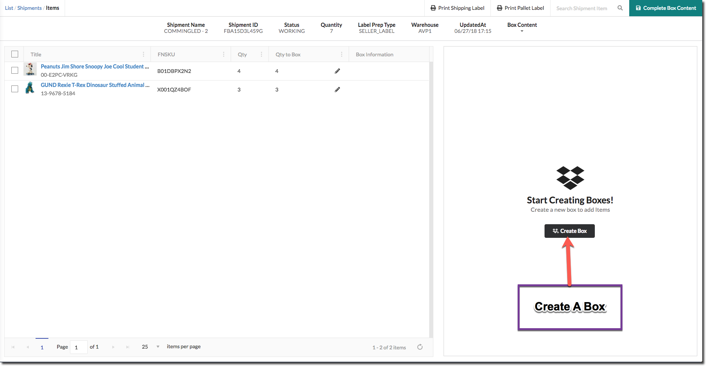

3\) You can Edit the Quantity to be Added in the Box through `Qty to Box`field. Select Items to be Added To Box. Go to `Add to Box`and Select the Box.

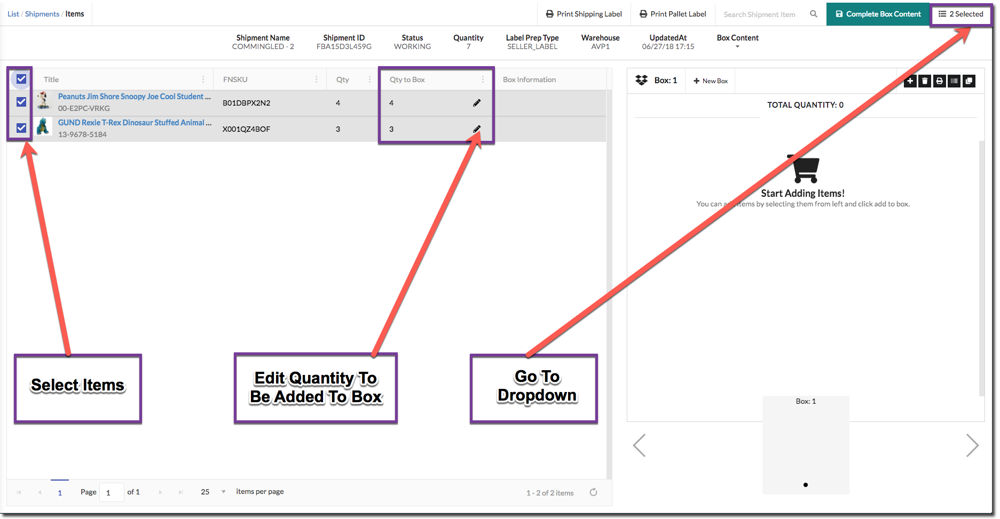

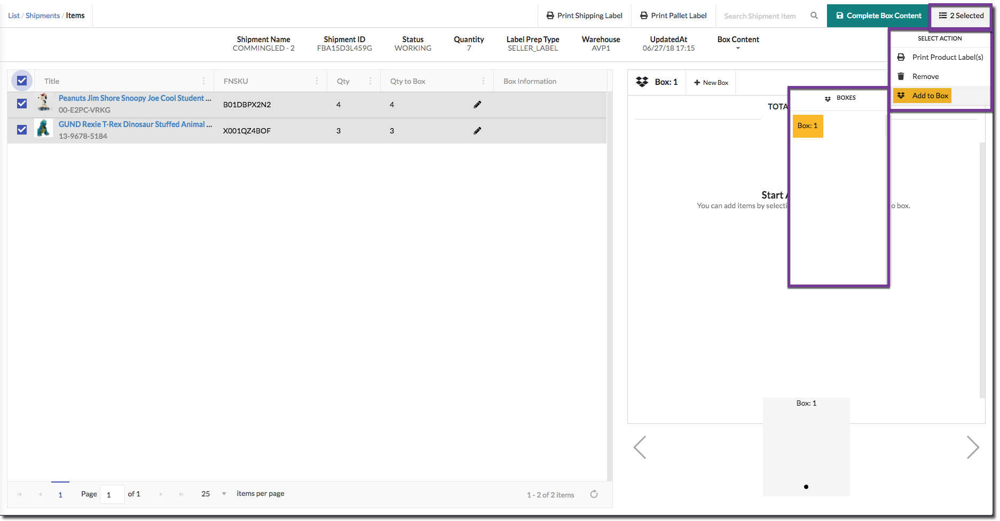

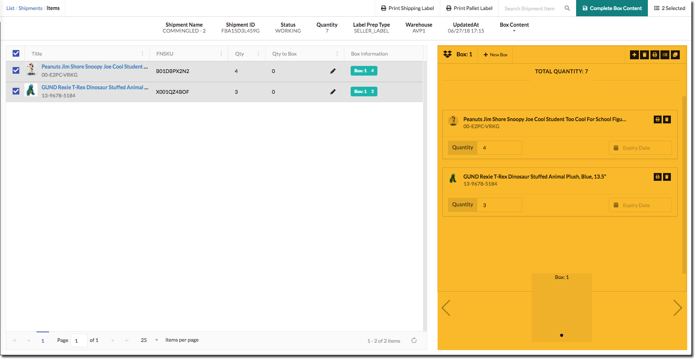

4\) Item quantity in a box can be edited in the box and you are also able to add a custom expiry date to a product.

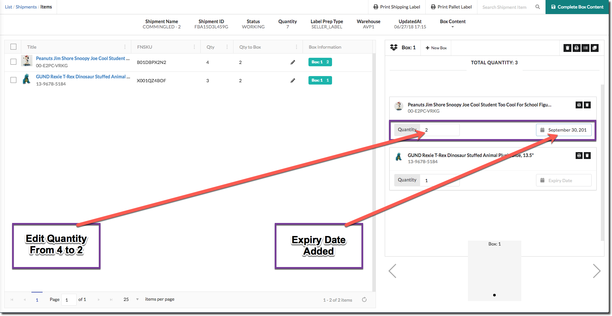

5\) A product can be removed from a box using delete button, Item label can be printed using the print button.

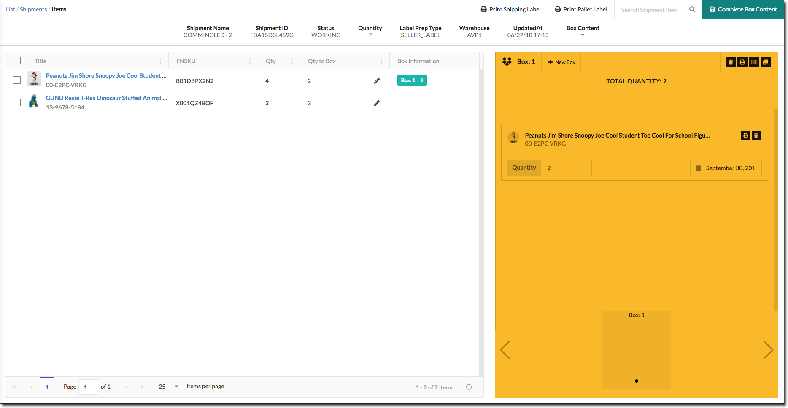

6\) Shipment Item List shows the number of products in a particular box and the remaining quantity to be packed.

7\) When All items are successfully packed click on `Complete Box Content` button on the top right corner. A Confirmation Dialog is there, Confirm it.


FEED -&gt; Submit Box Content Information through Feed Automatically.  
2D\_BARCODE -&gt; Submit Box Content Information by a Barcode on the Shipment.  
NONE -&gt; Amazon will Manually Process The Submitted Box Content. This may incur a Fee.


